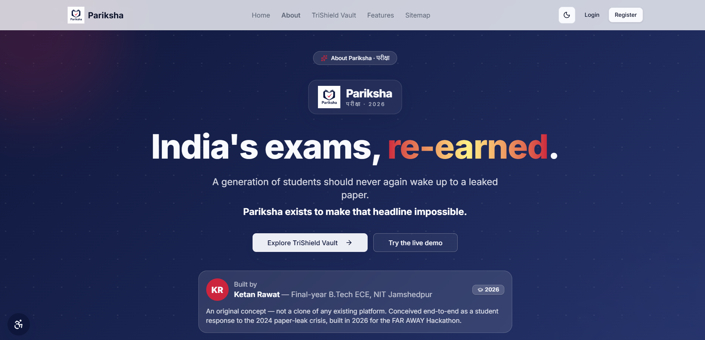
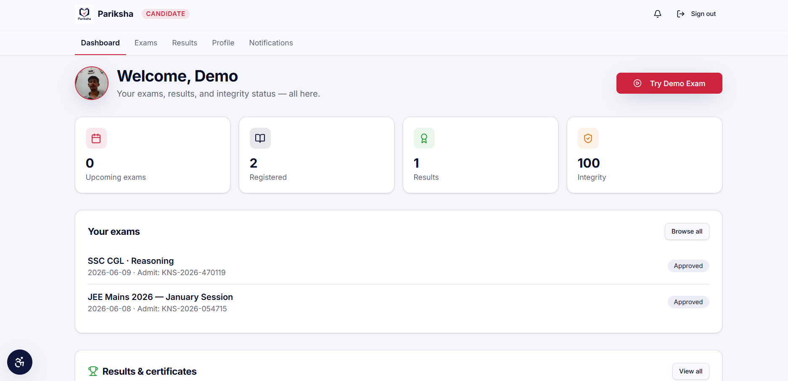
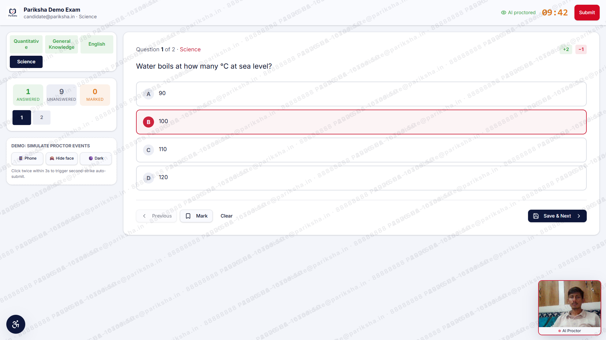
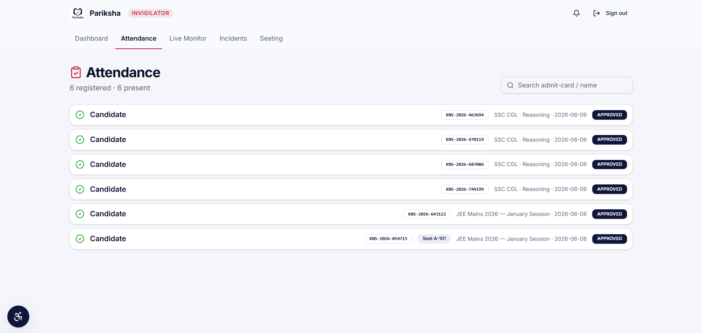
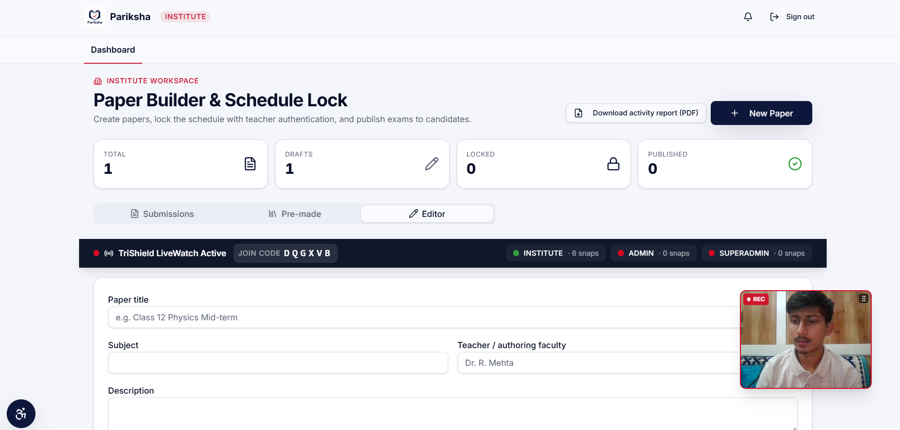
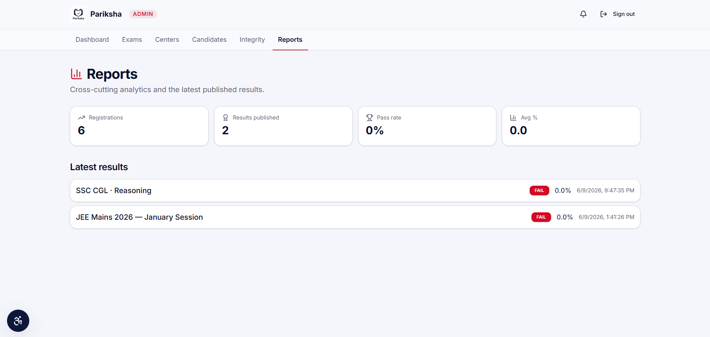
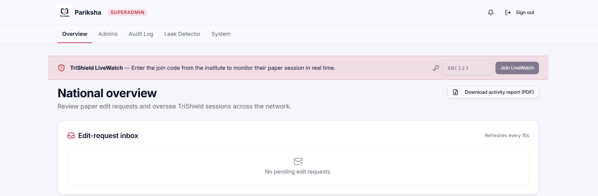
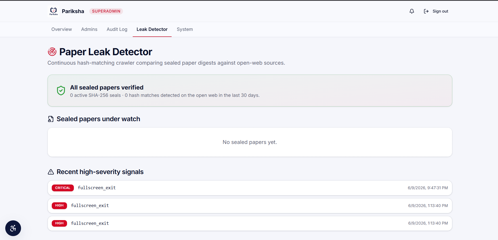
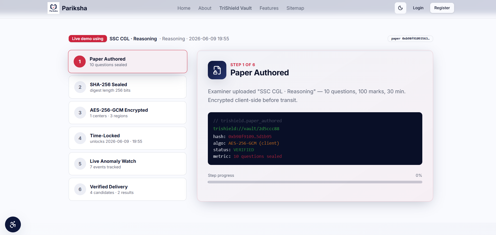
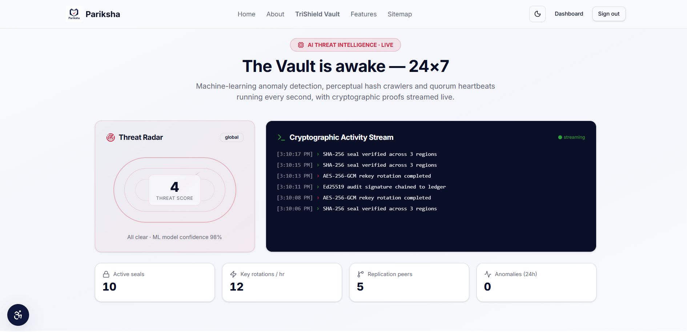

<div align="center">


# Pariksha · परीक्षा

### *"India's exams, re-earned."*

**The first cryptographic national examination integrity platform — built to make paper leaks structurally, mathematically impossible.**

🌐 **[pariksha-platform.lovable.app](https://pariksha-platform.lovable.app)**

[](https://pariksha-platform.lovable.app/)
[](https://faraway.dev)
[](https://github.com/Ketanrawat2004)
[](https://github.com/Ketanrawat2004/pariksha-platform)
[](https://www.linkedin.com/in/ketan-rawat-97a8aa2a0/)

<br/>

> Built by **Ketan Rawat** · Final-year B.Tech ECE · NIT Jamshedpur
>
> *An original concept — not a clone of any existing platform. Conceived end-to-end as a student response to the 2024 paper-leak crisis, built in 2026 for the FAR AWAY Hackathon.*

</div>

---

## Why I built this

I am writing this section the way I would say it out loud, because the rest of the README is technical and this part is not.

On 3 May 2026, **2.27 million students** sat for NEET-UG. Nine days later the NTA cancelled the entire exam — a Kota syndicate had been selling the paper before the bell even rang. In the weeks that followed, three names stayed with me:

- **Pradeep Manich**, 23, from Jhunjhunu — a labourer's son on his third attempt. His family had already sold land for his coaching.
- **Akanksha Chaturvedi**, 20, from MP. Her note: *"I had high hopes of scoring good marks, but now there is no guarantee I will perform just as well if I have to take the paper again."*
- **Maithili Ashok Sonwane**, 18, from Latur.

None of them failed the exam. The system failed around them. And honestly, this is the part of India's exam crisis that nobody really wants to put in a hackathon pitch — but it is exactly why I sat down to build Pariksha instead of a SaaS dashboard or a fintech clone.

The pattern is older than 2026:

| Year | Incident | Damage |
|------|----------|--------|
| 2026 | NEET-UG cancelled after Kota syndicate leak | 2.27 million students, 5+ deaths, CBI |
| 2024 | NEET-UG paper leaked from Hazaribagh via WhatsApp | 24 lakh aspirants, 1,563 re-tested, SC intervention |
| 2024 | UGC-NET cancelled the day after the exam | Entire test nullified nationwide |
| 2024 | BPSC — paper on Telegram one hour before start | State-wide re-exam |
| 2024 | SSC CGL Tier-1 postponed amid leak allegations | CBI investigating |
| 2024 | RPF Constable — proxy rings across 4 states | 70,000+ posts affected |
| 2017 | SSC scandal — systemic, internal | National protests, 20+ states |
| 2013–23 | Vyapam scam — ran inside the system for a decade | 55+ deaths, hundreds arrested |

**70+ confirmed leaks across 15 states since 2015. Roughly 1.7 crore aspirants disrupted.**

If you look at every one of these, the root cause is identical:

> One person with enough access had the power to act alone.

Encrypted PDFs, sealed envelopes, biometric gates, CCTV — they all treat symptoms. They all still let a single insider hold the whole paper. Pariksha is built on the opposite assumption: nobody, including me, the admin, or the institute, should ever be able to read a sealed paper alone. Not by policy. By mathematics.

---

## So what is Pariksha, actually?


*About — the "India's exams, re-earned" manifesto, builder credit, and entry points into the TriShield Vault and live demo.*

Pariksha is not a proctoring plugin and it is not a white-label exam host. Think of it as **the examination authority itself**, end-to-end — closer to a digital UPSC or SSC than to a typical edtech product. One student registers, pays, sits, gets caught cheating (or doesn't), and walks away with a cryptographically signed certificate. All of it on one stack.

Five roles drive the system: **candidate, invigilator, institute, admin, superadmin.** Each role only sees what its policies allow, and that is enforced by Row Level Security on every single table — not by `if (user.role === 'admin')` somewhere in the React code.

It is also live, today. Five roles work, Razorpay processes real test-mode payments, PDFs generate from real templates, Realtime updates fire without a page refresh, and the 6-step TriShield demo finishes in under a minute with three browser tabs open. Every screenshot below is from the deployed build, not Figma.

---

## Try it in 10 seconds (five roles, one password)

Open [pariksha-platform.lovable.app/login](https://pariksha-platform.lovable.app/login). There are five one-click demo cards on the login page — click a role, the form auto-fills, you're in. The password for every account is `Demo@1234`.

| Role | Email | What you'll land in |
|------|-------|----------------------|
| 🟣 **Superadmin** | `super@pariksha.in` | National overview, LiveWatch archive, the full immutable audit log, halt-session button |
| 🔵 **Admin** | `admin@pariksha.in` | Integrity dashboard, TriShield edit approvals, results management |
| 🟠 **Invigilator** | `invig@pariksha.in` | Live candidate grid, attendance, incident log |
| 🟢 **Candidate** | `candidate@pariksha.in` | Active exams, admit card, results, downloadable signed certificate |
| 🟤 **Institute** | `institute@pariksha.in` | Paper builder with live encryption, TriShield LiveWatch, the 6-step demo |

---

## How to use each role

### As a Candidate


*Candidate dashboard — welcome card, upcoming exams (SSC CGL, JEE Mains), integrity score 100, and a one-click **Try Demo Exam** button*

1. Sign in with `candidate@pariksha.in` / `Demo@1234`
2. Your dashboard shows upcoming exams (JEE Mains 2026, SSC CGL), your integrity score, and any results
3. Click **Try Demo Exam** (red button, top right) to launch the lockdown exam interface immediately
4. Go to **Notifications** to find your auto-generated admit card with QR code
5. Open **Results** to see your score breakdown, rank, percentile, and download your signed certificate

### Taking the Exam (Demo Exam)


*Inside the exam — diagonal watermark with candidate email + IP, AI Proctor webcam tile (bottom-right), section tabs, integrity timer, and the **DEMO: Simulate Proctor Events** panel (Phone / Hide face / Dark) for triggering live violations.*

1. The browser enters mandatory fullscreen — there is no skip
2. Face verification runs against your registration photo — a confidence bar climbs to GRANTED
3. You see the question navigator (left), current question with options (center), and a live countdown (top)
4. The demo panel shows **SIMULATE PROCTOR EVENTS** — click Phone, Hide face, or Dark to trigger integrity events
5. Every violation (tab switch, right-click, fullscreen exit, face mismatch) is logged in real time
6. Three fullscreen exits trigger automatic submission — this is not a soft limit
7. Answers auto-save every 30 seconds. Submit opens a summary modal before finalizing

### As an Invigilator


*Invigilator attendance — 6 registered · 6 present, admit-card numbers (KNS-2026-…), exam and date per row, and APPROVED chips. Search by admit card or candidate name in the top-right.*

1. Sign in as `invig@pariksha.in`
2. **Attendance** tab shows all registered candidates, their admit-card numbers, and approval status
3. Search by admit-card number or name using the search bar
4. **Live Monitor** tab shows the real-time integrity grid — colour-coded scores updating without page refresh
5. **Incidents** shows a log of all integrity events flagged from your centre, filterable by severity

### As an Institute


*Institute workspace — Paper Builder & Schedule Lock, draft/locked/published counters, and the black **TriShield LiveWatch Active** bar showing the join code (`D Q G X V B`) plus live snap counts for INSTITUTE / ADMIN / SUPERADMIN. The institute's own webcam recording tile is pinned bottom-right.*

1. Sign in as `institute@pariksha.in`
2. Click **+ New Paper** to create a paper — enter title, subject, and teacher/faculty name
3. Add questions — each encrypts in the browser using AES-256-GCM before leaving the device
4. When ready, initiate **Lock Paper** — this requires all three parties (institute, admin, superadmin) to be simultaneously present with active webcams
5. The black **TriShield LiveWatch Active** bar shows the join code, snapshot counts, and live camera status for all three roles
6. After locking, the paper cannot be read or modified by any single party alone — ever

### As an Admin


*Admin → Reports — cross-cutting analytics (registrations, results published, pass rate, average %) and the latest published results with per-exam status chips.*

1. Sign in as `admin@pariksha.in`
2. **Dashboard** shows live integrity events across all active sessions
3. **Integrity** tab shows every flagged session with event type, severity, and candidate details
4. **Exams** section lets you create new exams, manage centers, review candidates, and publish results
5. When an institute submits a paper edit request, it appears on your screen via Supabase Realtime — you approve or reject, opening a 15-minute timed window
6. **Reports** shows cross-cutting analytics — registrations, results published, pass rate, average score

### As Superadmin


*Superadmin overview — TriShield LiveWatch join, edit-request inbox, national session oversight*


*Leak Detector — SHA-256 continuous crawl, sealed papers under watch, recent high-severity signals*

1. Sign in as `super@pariksha.in`
2. **Overview** shows the national edit-request inbox, refreshing every 15 seconds, plus a download for the full activity PDF
3. **Audit Log** is the immutable permanent record of every action by every user across the entire platform — no delete permission exists for any role on this table, including superadmin
4. **Leak Detector** runs a continuous SHA-256 hash-matching crawler, comparing sealed paper digests against open-web sources — any match triggers a CRITICAL alert
5. **System** tab shows real-time infrastructure health

---

## TriShield Vault — the core innovation


*TriShield Vault — 6-step paper lifecycle: Paper Authored → SHA-256 Sealed → AES-256 Encrypted → Time-Locked → Live Anomaly Watch → Verified Delivery*


*TriShield AI threat intelligence — live threat radar, cryptographic activity stream, SHA-256 seal verifications, Ed25519 signature chain, AES-256-GCM key rotations*

This is the concept that does not exist anywhere else.

### The three-fragment key system

When an institute uploads questions, each question encrypts in the browser using **AES-256-GCM via the Web Crypto API** before any data leaves the device. The encryption key is then split into three independent fragments using **Shamir's Secret Sharing**:

```
INSTITUTE PASSKEY          PLATFORM SERVER          AUDITOR ACCOUNT
  (Fragment 1)               (Fragment 2)             (Fragment 3)
  PBKDF2-derived            ENV variable only         Independent role
  Never stored              Never in API              Separate party
       │                         │                         │
       └──────────── ANY 2 OF 3 ─┼─────────────────────────┘
                                 │
                         FULL AES-256-GCM KEY
                                 │
                    ┌────────────▼────────────┐
                    │   DECRYPTED QUESTIONS   │
                    │  Only during verified   │
                    │  active exam session    │
                    └─────────────────────────┘
```

**Fragment 1** — derived from the institute's private passkey using PBKDF2. Never transmitted. Never stored. Exists only in the institute's browser memory. Lose it, and the paper cannot be decrypted for editing — ever. This is intentional.

**Fragment 2** — generated and held by the platform server in an environment variable. Never returned in any API response to any client.

**Fragment 3** — held by an independently assigned auditor with no stake in the exam content.

Any two of three fragments reconstruct the full key. **One fragment alone reconstructs nothing.**

### Why this closes every attack vector

| Attack vector | Every existing platform | Pariksha TriShield |
|---------------|------------------------|-------------------|
| Corrupt institute employee modifies paper | Possible — direct DB access | Impossible — needs admin approval, permanently logged |
| Corrupt admin reads or steals questions | Possible — DB credentials sufficient | Impossible — no institute passkey available |
| Database attacker exfiltrates questions | Gets plaintext or weakly protected data | Gets AES-256-GCM ciphertext, zero key material |
| Institute and admin collude | Undetectable in most systems | Logged immutably, Fragment 3 auditor exists |
| Silent direct DB tampering | May go undetected for hours | SHA-256 mismatch detected in under 60 seconds, automatic |
| Physical presence faked for critical actions | No verification | LiveWatch webcam frames captured every 10s with timestamps |
| Anyone with DB credentials reads questions | Gets plaintext | Gets encrypted blob, key fragment not in DB |

### The edit workflow — neither party can act alone

When an institute needs to change a question after sealing, the process requires both parties at every step:

1. Institute submits an edit request with reason
2. Request appears on admin's screen via Supabase Realtime — no page refresh
3. Admin reviews and approves or rejects
4. If approved, a **15-minute edit window** opens with a countdown timer visible on both screens simultaneously
5. Institute enters their passkey → Fragment 1 reconstructed. Server contributes Fragment 2. Questions decrypt in the browser
6. Institute edits and clicks **Save and Re-encrypt** — questions encrypt immediately
7. A new SHA-256 hash is generated alongside the previous hash
8. The diff — old text struck through in red, new text highlighted in green — is written permanently to the audit log with both user IDs, both IP addresses, and an IST timestamp
9. Edit window closes automatically. Hash monitoring resumes

Neither party can initiate or complete any step of this workflow alone.

### TriShield LiveWatch — webcam presence for every critical action

For paper locking and editing, all three parties — institute, admin, and superadmin — must be **simultaneously present with active webcam feeds**.

The Lock Paper button is physically disabled until all three cameras are verified active. Webcam frames capture every 10 seconds per party, stored in a private storage bucket. All three feeds are visible to all three parties. The superadmin sees a live keystroke activity panel — which question is being edited, when typing starts and stops, when save is clicked — in real time. An emergency **Halt Session** button lets the superadmin veto any change in progress and discard unsaved edits.

---

## The exam interface

The exam runs as a proper lockdown browser inside the web platform. No separate app download required.

**Entry sequence:**
- Browser requests mandatory fullscreen — no skip or override
- Face verification using face-api.js — TinyFaceDetector + FaceRecognition128 — confidence must pass 70% against registration photo
- Webcam activates. A confidence bar counts up. Green ACCESS GRANTED appears at threshold

**During the exam, all of these are simultaneously blocked and logged as integrity events:**
- Tab switch (visibilitychange API)
- Window focus loss (blur event)
- Copy or cut (clipboard API + toast warning)
- Right-click (contextmenu blocked)
- F12 and all common devtools keyboard shortcuts
- Fullscreen exit — **three exits trigger automatic submission**

**Face re-verification runs silently every 5 minutes.** Multiple faces detected, no face for 30 seconds, or face mismatch all log at critical severity and alert the invigilator in real time.

The question navigator shows unanswered (gray), answered (green), marked for review (amber), current (navy). Timer turns amber below 10 minutes and red below 5 with a pulse animation. Answers auto-save every 30 seconds.

---

## The complete exam lifecycle

A student registers with name, email, phone, and Aadhaar (hashed SHA-256 client-side — raw number never touches the server) plus a mandatory live webcam photo. They pay through Razorpay by category fee. Three days before the exam an admit card auto-generates with their photo, seat number, center address, and a functioning QR code — delivered as a notification.

After the exam, results evaluate automatically. The student gets their score, section breakdown, rank, percentile, and a **downloadable Ed25519-signed certificate** within minutes. The certificate has a unique ID and a QR code linking to a public verification page — anyone can confirm it is genuine.

---

## Exam patterns supported

| Exam | Sections | Questions | Marks | Duration | Negative |
|------|----------|-----------|-------|----------|---------|
| JEE Mains 2026 | Physics, Chemistry, Maths | 75 — 20 MCQ + 5 Integer per section | 300 | 180 min | −1 MCQ, 0 Integer |
| JEE Advanced 2026 | Paper 1 + 2, PCM | 120 mixed types | 360/paper | 180 min | Variable |
| NEET 2026 | Physics, Chemistry, Botany, Zoology | 180 — 45 per section | 720 | 200 min | −1 wrong |
| SSC CGL 2026 | Reasoning, GA, Quant, English | 100 — 25 per section | 200 | 60 min | −0.5 |
| Custom | Configurable | Any count | Any | Any | Any |
| Coding | Any | Any | Any | Any | None |
| Subjective | Any | Any | Manual / AI grading | Any | None |

---

## Architecture

```
┌─────────────────────────────────────────────────────────────────┐
│                       PARIKSHA PLATFORM                         │
├─────────────────────────────────────────────────────────────────┤
│                                                                  │
│  ┌───────────────────────────────────────────────────────────┐  │
│  │                    BROWSER LAYER                          │  │
│  │  React 19 · TanStack Start (SSR) · Vite 7                │  │
│  │  Tailwind CSS v4 · shadcn/ui · TanStack Query            │  │
│  │                                                           │  │
│  │  ┌─────────────────────────────────────────────────┐     │  │
│  │  │           BROWSER SECURITY (client-side)        │     │  │
│  │  │  Web Crypto API — AES-256-GCM, SHA-256, PBKDF2 │     │  │
│  │  │  face-api.js — TinyFaceDetector + Recognition   │     │  │
│  │  │  getUserMedia — live capture + LiveWatch frames │     │  │
│  │  │  Shamir Secret Sharing — key fragment split     │     │  │
│  │  └─────────────────────────────────────────────────┘     │  │
│  └───────────────────────────────────────────────────────────┘  │
│                              │                                   │
│  ┌───────────────────────────▼───────────────────────────────┐  │
│  │               LOVABLE CLOUD (Supabase)                    │  │
│  │  PostgreSQL + RLS    Supabase Auth     Supabase Realtime  │  │
│  │  14 tables           5 roles           WebSocket channels │  │
│  │  Row Level Security  JWT httpOnly      Live updates       │  │
│  │                                                           │  │
│  │  Supabase Storage    Edge Functions                       │  │
│  │  Private buckets     join-watch-session                   │  │
│  │  Signed URLs 1hr     paper-hash-monitor (every 60s)      │  │
│  │  Face photos         generate-session-report              │  │
│  └───────────────────────────────────────────────────────────┘  │
│                              │                                   │
│  ┌───────────────┐  ┌────────┴──────┐  ┌───────────────────┐   │
│  │   Razorpay    │  │  jsPDF +      │  │  Lovable AI       │   │
│  │   Test Mode   │  │  qrcode npm   │  │  Gateway (Gemini) │   │
│  │   Payments    │  │  Certificates │  │  Chatbot          │   │
│  └───────────────┘  └───────────────┘  └───────────────────┘   │
└─────────────────────────────────────────────────────────────────┘
```

---

## Tech stack

| Layer | Technology | Purpose |
|-------|-----------|---------|
| Framework | React 19 + TanStack Start | SSR, file-based routing, server functions |
| Build tool | Vite 7 | Fast dev server, optimized production builds |
| Styling | Tailwind CSS v4 + shadcn/ui | Utility-first styling, accessible UI components |
| State management | TanStack Query v5 | Server state, caching, background refetch |
| Forms | React Hook Form + Zod | Type-safe validation, schema enforcement |
| Backend | Lovable Cloud (Supabase) | PostgreSQL, Auth, Realtime, Storage, Edge Functions |
| Realtime | Supabase Realtime (WebSocket) | Live integrity events, LiveWatch sync, notifications |
| Cryptography | Web Crypto API | AES-256-GCM encryption, SHA-256 hashing, PBKDF2 |
| Key splitting | Shamir's Secret Sharing | 3-fragment key distribution for TriShield |
| Signatures | Ed25519 | Certificate signing and independent verification |
| Biometric | face-api.js (TensorFlow.js) | TinyFaceDetector + FaceLandmark68 + FaceRecognition128 |
| Webcam | getUserMedia API | Registration photo + LiveWatch session capture |
| Payments | Razorpay test mode | Category-based fee collection |
| PDF | jsPDF + html2canvas | Certificates and admit cards |
| QR | qrcode (npm) | Admit card and certificate verification QR |
| Charts | Recharts | Integrity dashboards, result analytics |
| AI chatbot | Lovable AI Gateway (Gemini) | Platform Q&A, exam guidance |
| Email | Lovable Email Connector | Verification, admit cards, results, certificates |

---

## Security overview

**Authentication**
- Supabase Auth — JWT stored in httpOnly cookies
- Email verification required before first login
- 5 failed attempts locks account for 15 minutes via Edge Function rate limiting
- Auto-logout after 30 minutes inactivity with 60-second countdown warning
- Every login and logout written to audit_log

**Data protection**
- Aadhaar hashed with SHA-256 in browser before transmission — raw number never touches the server
- Face photos in private Supabase Storage — accessed only via signed URLs with 1-hour expiry
- Questions stored only as AES-256-GCM encrypted blobs — never decrypted server-side except through verified Edge Function during active exam
- Session snapshots auto-purged after 90 days — DPDP Act 2023 compliance
- Audit records permanent

**Access control**
- Row Level Security on every table — candidates read only their own rows, invigilators only their centre
- audit_log has no delete permission for any role — not even superadmin
- Content Security Policy headers on all routes
- All inputs sanitized through Zod schemas with server-side validation via Edge Functions

**Paper integrity**
- SHA-256 hash verification running every 60 seconds via background Edge Function
- Three-fragment key — no single party can decrypt alone
- Edit workflow requires two-party approval, logged immutably
- LiveWatch webcam presence required for all critical actions

---

## Local setup

```bash
git clone https://github.com/Ketanrawat2004/pariksha-platform.git
cd pariksha-platform
npm install
cp .env.example .env
```

Fill in `.env`:

```env
VITE_SUPABASE_URL=your_lovable_cloud_project_url
VITE_SUPABASE_ANON_KEY=your_lovable_cloud_anon_key
VITE_RAZORPAY_KEY_ID=rzp_test_xxxxxxxxxxxxxxxxxx
VITE_DEMO_MODE=true
```

```bash
npx supabase db push
npm run seed
npm run dev
```

Open `http://localhost:3000`

---

## Pre-loaded demo data

- **JEE Mains 2026** — 75 questions across Physics, Chemistry, Mathematics — exam date set to today — Enter Exam active immediately for demo candidate
- **NEET 2026** — 180 questions — draft status
- **SSC CGL 2026** — 100 questions — completed status with full results and certificates for 5 candidates
- Three integrity events on one session: tab_switch (medium), face_mismatch (critical), fullscreen_exit (high)
- One paper edit request in pending status — ready for the TriShield two-party approval demo
- One completed TriShield edit history showing old hash, new hash, diff, and permanent audit trail

---

## Database schema (14 tables, RLS on every one)

```
profiles          — id, role, aadhaar_hash (SHA-256 only), face_photo_url (signed)
centers           — id, district, state, invigilator_id, capacity
exams             — id, title, paper_hash, platform_key_fragment (server only, never API)
questions         — id, question_text_encrypted, options_encrypted, correct_answer_encrypted
registrations     — id, admit_card_number (PKS-YYYY-XXXXXX), razorpay_order_id
exam_sessions     — id, integrity_score, device_fingerprint, is_flagged [Realtime]
integrity_events  — id, event_type, severity, details [Realtime]
answers           — id, selected_option, time_taken_seconds, changed_count
results           — id, total_score, rank, percentile, certificate_id (CERT-PKSH-XXXXXX)
audit_log         — id, action, ip_address, timestamp [NO DELETE for any role]
paper_edit_requests — id, pre_edit_hash, post_edit_hash, changes_made (jsonb diff)
trishield_watch_sessions — id, snapshot counts per party, device fingerprints [Realtime]
trishield_session_reports — id, verification_status (COMPLETE|INCOMPLETE)
notifications     — id, type, admit_card_data (jsonb) [Realtime]
```

---

## Routes

**Public** — `/` `/login` `/register` `/about` `/trishield-vault` `/sitemap` `/verify/:certificateId` `/verify/admit-card/:number` `/forgot-password`

**Candidate** — `/candidate/dashboard` · `/candidate/exams` · `/candidate/exam/:id/start` · `/candidate/exam/:id/take` · `/candidate/exam/:id/submitted` · `/candidate/results` · `/candidate/results/:resultId` · `/candidate/notifications` · `/candidate/profile`

**Admin** — `/admin/dashboard` · `/admin/exams` · `/admin/exams/create` · `/admin/exams/:examId` · `/admin/integrity` · `/admin/integrity/:sessionId` · `/admin/centers` · `/admin/candidates` · `/admin/trishield` · `/admin/reports` · `/admin/notifications/send`

**Invigilator** — `/invigilator/dashboard` · `/invigilator/live-monitor` · `/invigilator/attendance` · `/invigilator/incidents` · `/invigilator/seating`

**Institute** — `/institute/dashboard` · `/institute/questions/:examId` · `/institute/edit-requests`

**Superadmin** — `/superadmin/dashboard` · `/superadmin/audit-log` · `/superadmin/admins` · `/superadmin/trishield-reports` · `/superadmin/system`

---

## Scalability

The platform runs on Lovable Cloud's PostgreSQL infrastructure with horizontal auto-scaling. Supabase Realtime WebSocket connections support 100,000+ concurrent candidates. All exam sessions are stateless — any server node handles any session. The encrypted question delivery Edge Function scales independently from the main API. Edge-rendered routes via TanStack Start keep TTFB low from tier-3 cities.

---

## Future scope

- **Aadhaar e-KYC via DigiLocker** — one-shot verified identity, no manual document upload
- **Blockchain-anchored paper hashes** — SHA-256 hash written to Polygon at paper seal time, immutable public proof predating any possible leak
- **Hardware Security Module for Fragment 2** — replace environment variable with HSM, making physical server compromise insufficient
- **Zero-knowledge proofs** — candidates verify their paper was not tampered with between seal and delivery, without revealing correct answers
- **WebRTC invigilator video walls** — live video feeds from all physical exam centres in one dashboard
- **AI answer evaluation** — automated scoring for subjective and coding questions
- **22-language support** — all scheduled languages under the Indian constitution
- **DigiLocker certificate integration** — certificates verifiable through the national DigiLocker infrastructure directly

---

## Why I think this deserves a serious look

Three honest reasons, not a pitch deck:

1. **The problem is front-page and recent.** The NEET 2026 cancellation hit 2.27 million students and produced confirmed suicides six weeks before this submission. This is not a hypothetical fintech UX problem.
2. **TriShield Vault is a new category, not a feature.** I checked — no Indian or international exam authority currently runs simultaneous multi-party key custody with Shamir's Secret Sharing on question papers. The whole point is that the single-party control vulnerability behind every major leak in Indian exam history simply cannot exist in this design.
3. **It actually runs.** Five roles, real payments, real PDFs, real Realtime, the 6-step TriShield demo in under 60 seconds. Every screenshot here is from the deployed app. If it breaks during evaluation, ping me on LinkedIn and I'll redeploy in front of you.

---

## About me

I'm **Ketan Rawat**, final year B.Tech ECE at NIT Jamshedpur. Pariksha is a solo build — design, schema, RLS, crypto, the lot. The TriShield Vault concept (three-party Shamir custody + time-locked decryption + continuous webcam presence for every critical paper action) is original to this project. It is a direct response to NEET 2024 and 2026, not a fork of any existing exam platform.

[GitHub](https://github.com/Ketanrawat2004) · [LinkedIn](https://www.linkedin.com/in/ketan-rawat-97a8aa2a0/) · [Live Platform](https://pariksha-platform.lovable.app)

---

*Built for FAR AWAY Hackathon 2026 · Examinations Theme.*
*Every mark, earned.*

---

> If you are a student affected by the NEET 2026 cancellation and you're struggling — **iCall: 9152987821** (free, confidential). Please call.
